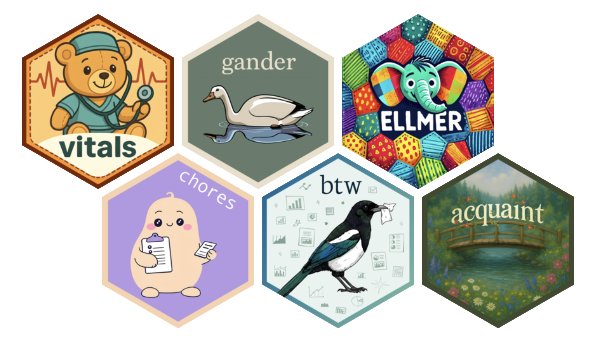

# Demo for UFDS, June 2025 

Source code and slides for a demo with students at UFDS. 

I've included some useful links related to each of the talk sections below.

## Part 1: Have a chat

To create a chat object:

* First, try `chat_github()`—that should "just work" if you're a Git user.
     - You might see a "The `seed` argument of..." warning. Just ignore it.
* If your Claude for Students account has been accepted already, use `chat_anthropic()`.
     - Grab the API key from your Anthropic account and then `Sys.setenv(ANTHROPIC_API_KEY="<pasteYourKeyHere>")`
     - Add the above to your .Rprofile, perhaps with `usethis::edit_r_profile()`, to set that key every time you start R.

You can use [`live_browser()`](https://ellmer.tidyverse.org/reference/live_console.html) to chat with an ellmer Chat object as if it was on a website.

## Part 2: The system prompt

* The [ellmer docs](https://ellmer.tidyverse.org/articles/ellmer.html#what-is-a-prompt) have some good high-level notes on prompting, and a [vignette](https://ellmer.tidyverse.org/articles/prompt-design.html) that goes into further detail.
* It's not unusual for prompts to be many thousands of words long. [Here's one I wrote](https://github.com/simonpcouch/chores/blob/main/inst/prompts/cli-replace.md) late last year.

## Intermission: tokens

* More [high-level docs on tokens](https://ellmer.tidyverse.org/articles/ellmer.html?q=token#what-is-a-token) from ellmer.
* OpenAI hosts its [tokenizer](https://platform.openai.com/tokenizer), which can be fun to play with.
* There are a bunch of different websites that have [API pricing tables](https://www.botgenuity.com/tools/llm-pricing).

## Part 4: Putting it all together

* In the final application, you might want to use [`chat_structured()`](https://ellmer.tidyverse.org/reference/Chat.html#method-chat-structured-),
    - This will help ensure you _actually_ get structured data rather than just asking for it and hoping the model gives it to you.
    - Some providers won't support this as well as others.
* After you write that function, the next step might be to apply it over a directory of image files, perhaps using `list.files()`.
* You can use the [ellmer assistant](https://jcheng.shinyapps.io/ellmer-assistant/) to help you write ellmer code. It's an [app built on top of ellmer](https://github.com/jcheng5/ellmer-assistant?tab=readme-ov-file) that incorporates all of ellmer's documentation into the system prompt.

## Appendix A: Providers

* [The home page](https://ellmer.tidyverse.org/) of ellmer's docs outline what providers are available and how to choose among them.

## Appendix B: Evaluation

* The [vitals package](https://vitals.tidyverse.org/) allows you to evaluate products built with ellmer.
    - Your "dataset" would be a data frame of potential questions that the system should be able to answer; e.g. pairs of satellite images and questions about them.
    - Your "solver" would be the function that takes a path to an image and returns some classification / description of it.
